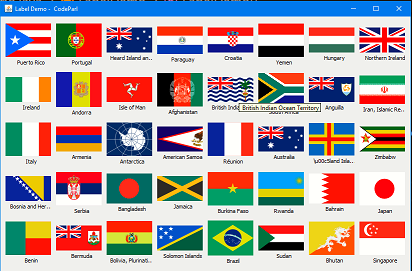

# JLabel demo with country flags

## screenshot

## About this code

This code example shows how to use JLabel  by displaying countries flag
along with their respective names in a grid that uses GridLayout manager.
In this code we used a simple json file containing country names and
converted it into A HashMap that we used to get abbreviated name that match
a given flag for that country.

## How to run this code

To run this code example, simply download the [jdk](https://www.oracle.com/java/technologies/javase-jdk16-downloads.html)  from oracle website and install it on your machine, then install [VSCode](https://code.visualstudio.com/download) and install it, then open the code example in VSCode. You must install java extension before working with this code example in VSCode.

## Author

This code example was writted by [Hassan Mugabo - aka Codeparl](https://github.com/codeparl)

## More code examples

For more code examples, please checkout [codeparl.com](https://codeparl.com)

## License

Licensed under MIT (https://github.com/codeparl/JLabel-demo-with-country-flags/blob/master/LICENSE)